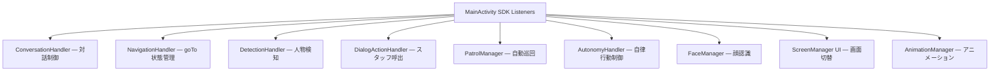

# アーキテクチャ設計書

## 1. 全体構成

Single Activity (`MainActivity.kt`) が Temi SDK の 9 つのリスナーを実装し、
各 Handler クラスに処理を委譲する構成。

## 2. 状態管理

`StateManager` が `MutableStateFlow<AppState>` を保持し、
`AppState.canTransitionTo()` による遷移許可マトリクスで不正遷移を防ぐ。

### AppState 一覧

| 状態 | 説明 | 主な遷移先 |
|------|------|-----------|
| Idle | 待機中 | Greeting, Listening, Autonomous, Navigating |
| Greeting | 挨拶表示中 | Listening, Speaking |
| Listening | ASR 待受中 | Thinking, Speaking, Idle (タイムアウト) |
| Thinking | AI 推論中 | Speaking, Navigating, StaffCall |
| Speaking | TTS 発話中 | Listening, Navigating |
| Navigating | goTo 移動中 | Arrival, Idle (abort) |
| Arrival | 目的地到着 | Listening, Idle |
| Autonomous | 巡回中 | Listening, Idle |
| StaffCall | スタッフ呼出中 | Idle |
| Error | エラー | Speaking |

## 3. AI 推論フロー (ReAct Engine)

ユーザー発話 → ConversationHandler.processUserQuery() → ReActEngine.run() → GeminiProvider.generateWithTools() [最大 5 イテレーション] → AI が tool_call を返す → ToolRegistry で実行 → 結果を AI に返す → AI が純テキストを返す → ループ終了 → TTS 発話 (speakInChunks) → onAllSpeechComplete → robot.wakeup() → ASR 再開

### 登録ツール

| ツール名 | 機能 |
|---------|------|
| speak | TTS 発話 |
| navigate | goTo ナビゲーション (NavigationHandler 経由) |
| ask_user | TTS で質問 + ASR 待受 |
| turn | 指定角度回転 |
| tilt_head | 頭部チルト |
| get_available_locations | 登録地点一覧取得 |
| call_staff | スタッフ呼出 UI 表示 |

## 4. 音声対話ループ

Temi SDK の `wakeup()` + `onConversationStatusChanged(status=2)` パターンを採用。

1. speakAndListen(text)
2. TemiTtsProvider.speak(text) # TTS で発話
3. TemiSttProvider.startListening() # robot.wakeup() で ASR 開始
4. onConversationStatusChanged(status=2, text=...) # ASR 結果
5. TemiSttProvider.markAsHandled() # 重複防止
6. ConversationHandler.onAsrResult(text)

**重要**: `robot.askQuestion()` は使用しない。`wakeup()` に統一。

## 5. ナビゲーションフロー

1. NavigateTool.execute() or DialogActionHandler
2. navigationHandler.isNavigating = true
3. robot.goTo(location)
4. onGoToLocationStatusChanged()
   - "complete" → turnBy(180°) → handleArrival()
   - "abort" → リトライ (最大 3 回) or スタッフ呼出
5. NavigationAwaiter.onStatusChanged() → coroutine 再開

## 6. 巡回パトロール

ScreenManager.startIdleTimer() [60秒] → PatrolManager.startPatrol() → robot.goTo(location) [ランダム順] → NavigationAwaiter.awaitArrival() → TTS プロモーション発話 → 120秒待機 → 次の地点 → 人物検知 or ASR で stopPatrol()

## 7. 既知の制約事項

- `DialogActionHandler` に旧管線の残骸 (isGuideMode 等) が残存。Phase 3 以降で整理予定
- `AutonomyHandler` の goToLocation は NavigationHandler を経由しない
- System Prompt が GeminiProvider と PersonaPromptBuilder の 2 箇所に存在
- 単体テスト未整備
