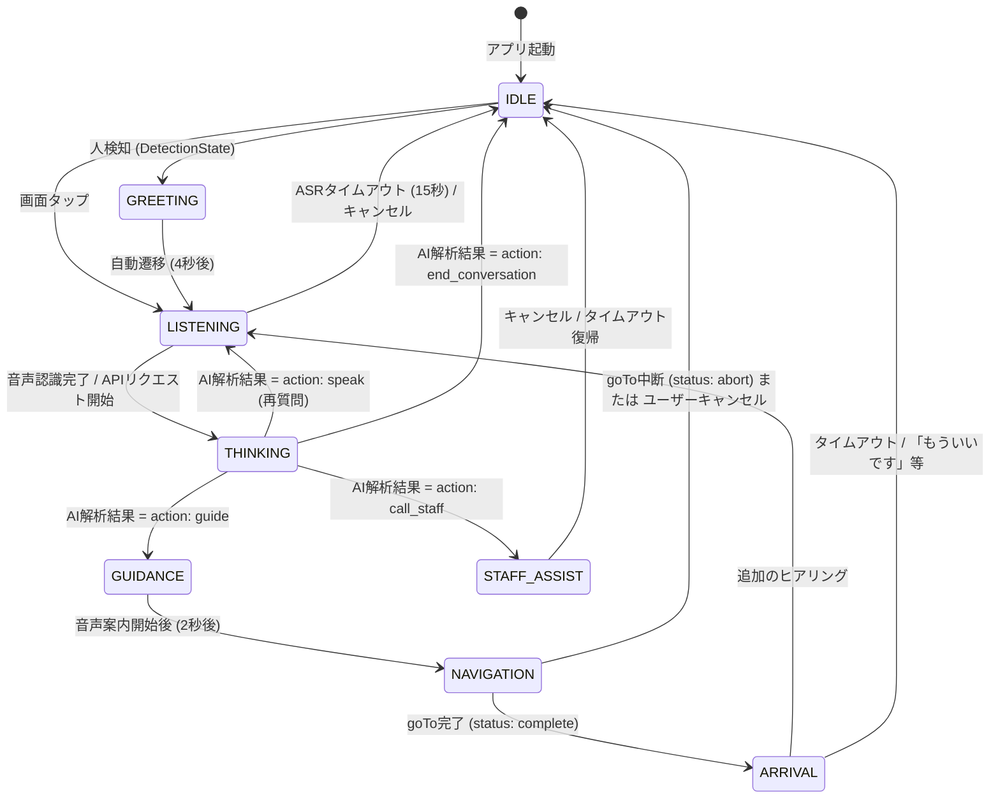

# 技術設計書 (Architecture)

本ドキュメントでは、`temiguide` アプリケーションの画面遷移、状態管理、AI連携フロー、および Temi SDK の利用方式について解説します。

## 1. 画面遷移図 (Screen Flow)

単一の `MainActivity.kt` 上で、`FrameLayout` 内の各 `View` の `Visibility` を切り替えることで画面遷移を実現しています。

## 2. 状態管理 (State Management)

`MainActivity` 内の以下のフラグによって、アプリの現在の状態と重複実行の防止を管理しています。

| フラグ名 | 型 | 用途 | 変更のタイミング (Set / Reset) |
|---|---|---|---|
| `isListening` | Boolean | マイクによる音声入力を待機しているか | `startListening()` や `speakAndListen()` 呼び出し時に `true`。ASR完了 (`onAsrResult`)、タイムアウト時、キャンセル時に `false`。 |
| `isGuideMode` | Boolean | AIの判定により、目的地への案内が承認された状態 | `executeAction("guide")` 時に `true`。 案内完了(`complete`)、中断(`abort`)、一定時間人が不在の場合に `false` にリセット。 |
| `isNavigating` | Boolean | ロボットが物理的に移動中(`goTo` コマンド発行後)であるか | 実際の `robot.goTo()` 呼び出し直前に `true`。 ステータスが `complete` または `abort`、`pause` アクション時に `false`。 |
| `isArrivalListening` | Boolean | 目的地到着後、追加の要望を聞いている特殊状態 | `handleArrival()` による着到スピーチ開始時に `true`。 ASR完了時、タイムアウト時、キャンセル時に `false`。 |
| `isWelcomeSpeaking` | Boolean | 初回起動時の挨拶発話中であるか | `onRobotReady` で `true`。 TTS完了 (`onTtsStatusChanged: COMPLETED`) 時に `false`。 |
| `peopleDetected` | Boolean | Temiのセンサーが人を認識しているか | `onDetectionStateChanged` の引数 `state == 1` で `true`、それ以外で `false`。 |

> **注意**: すべての遅延実行(`postDelayed`)は `postSafely()` ラッパーを経由しており、画面破棄時やキャンセル時に未実行の `Runnable` が安全に破棄される構造になっています。

## 3. AI連携フロー (AI Integration Flow)

1. **音声入力**: 対話ループ中は `robot.askQuestion()` で発話後に自動でASRを起動。純粋なASR起動のみが必要な場合は `robot.wakeup()` を使用（`JA_JP`, `EN_US`, `ZH_CN`対応）。参照: 公式Issue #427。
2. **ASR結果受信**: `onAsrResult` コールバックで文字列を受け取る。「戻って」等の即時終了キーワードを最初に評価。
3. **会話履歴の構築**: `conversationHistory.add()` にユーザー発話を記録し、`SYSTEM_PROMPT_TEMPLATE` に動的な JSON 形式の `locationInfo` を埋め込んで System 情報を生成。
4. **APIリクエスト**: `Retrofit` を介して Gemini API に対してリクエストを送信。
5. **JSON解析**: 取得した文字列フォーマットを整形 (`cleanJson()`) し、Gson で `TemiActionResponse` オブジェクトにマッピング。パース失敗時は `fallbackSpeak()` へ。
6. **アクション実行**: `executeAction()` にて `action` の値（`guide`, `speak`, `call_staff`, `end_conversation`, `pause`）に基づき、画面遷移とロボット操作を決定。

## 4. Temi SDK 利用箇所と注意事項

- **ナビゲーション (`robot.goTo`)**
  - 使用箇所: `executeAction("guide")` および `returnToHome()`
  - パラメータ `noRotationAtEnd = true`: 到着時にデフォルトの向きに戻す機能を無効化し、接客に自然な角度を維持するために使用。
  - **ガード句**: 再入防止のため、呼び出し直前に `if (isNavigating) return` の確認が必須。
- **到着後の旋回 (`robot.turnBy`)**
  - 使用箇所: `onGoToLocationStatusChanged` の `complete` 時。
  - 用途: 案内完了後、お客様の方（後方180度）を向くために実行。
- **音声認識 (`robot.askQuestion` / `robot.wakeup`)**
  - `askQuestion()` は発話後に自動でASRを開始する、**対話ループの主要手段**（公式Issue #427推奨）。`speak()` + `wakeup()` の組み合わせはナビゲーション切替時など、発話後にASRが不要な場合に使用する。
- **音声合成 (`robot.speak` / `TtsRequest`)**
  - **注意**: `speakOnly()`（発話のみ・ASR不要の場合）では `isShowOnConversationLayer = false` を指定し、デフォルトのシステムUIオーバーレイを防ぐ。`askQuestion()` 使用時はSDKが内部で自動管理するため手動指定は不要。また、レスポンスJSON内の `language` フィールドをもとに動的に言語を変更。
- **Kiosk モード**
  - `AndroidManifest.xml` および `robot.requestToBeKioskApp()` で設定され、店舗用サイネージとしての全画面占有を実現。

## 5. アニメーション管理方式

- UIのアニメーションは `ValueAnimator` と `ObjectAnimator` を用いて、プログラム側で制御されています（例：`startIdleAnimations()`, `startThinkingAnimation()`）。
- XML側では `AnimatedVectorDrawable` (`avd_cat_concierge_idle.xml`) を使用し、猫コンシェルジュのまばたきや尻尾の動きなどの複雑なベクターアニメーションを実現しています。
- 各画面遷移の際、`showScreen()` 内で `stopAllAnimations()` を必ず呼び出し、バックグラウンドでのアニメーション描画によるリソース浪費を防いでいます。
